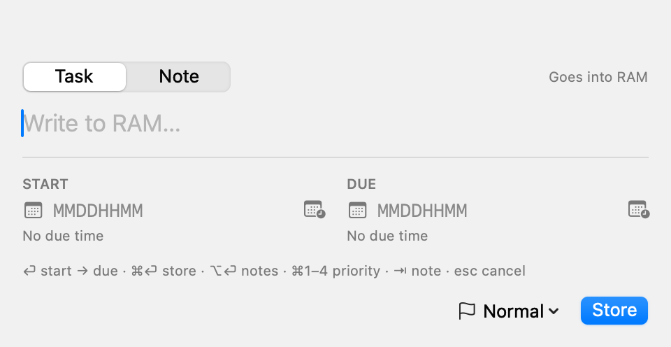
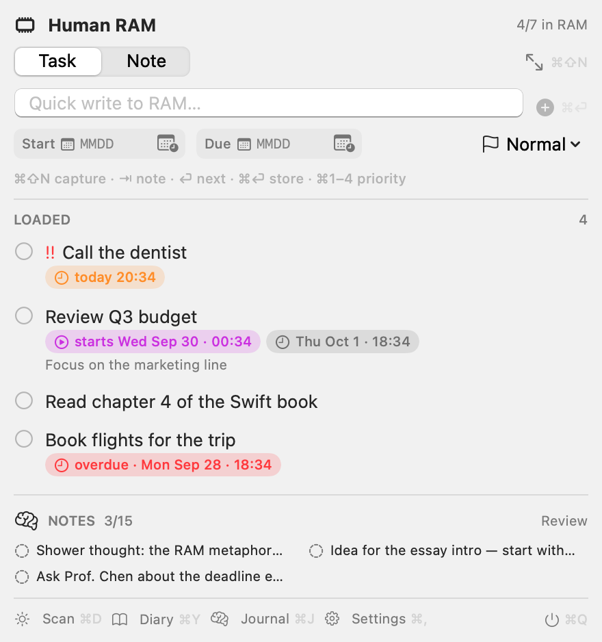
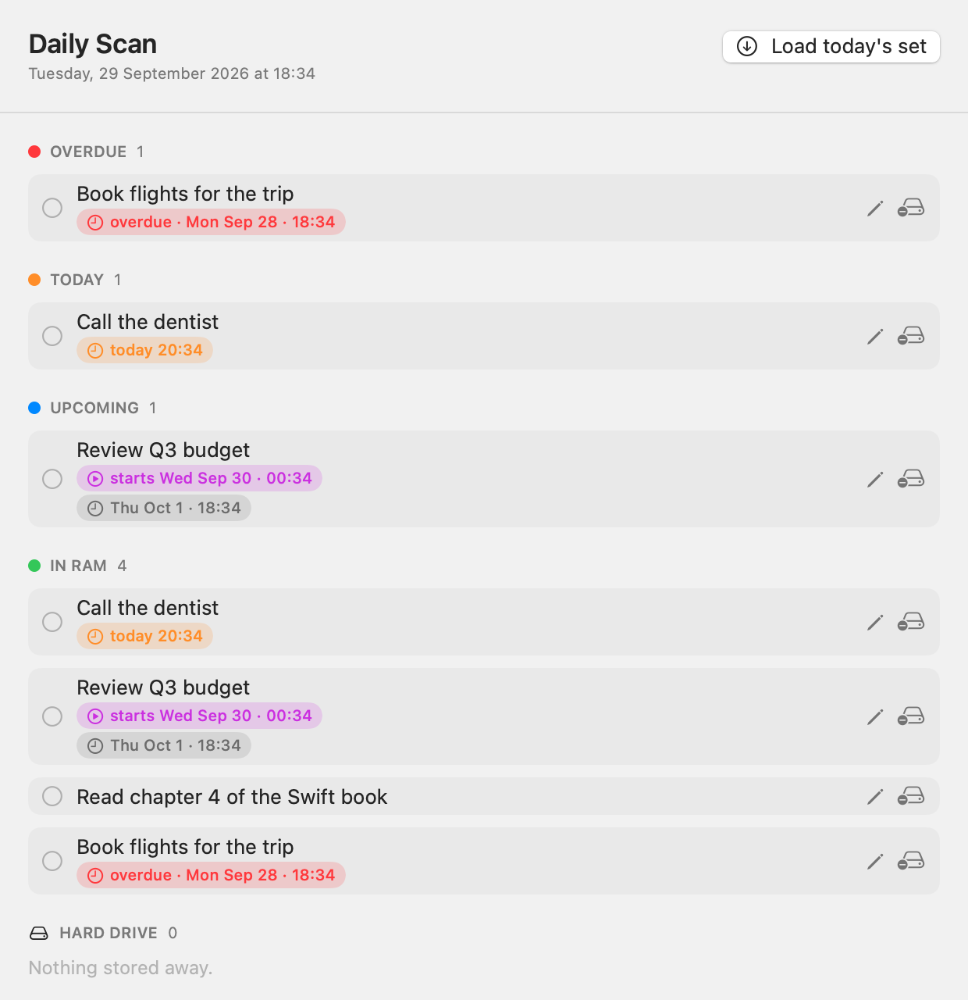
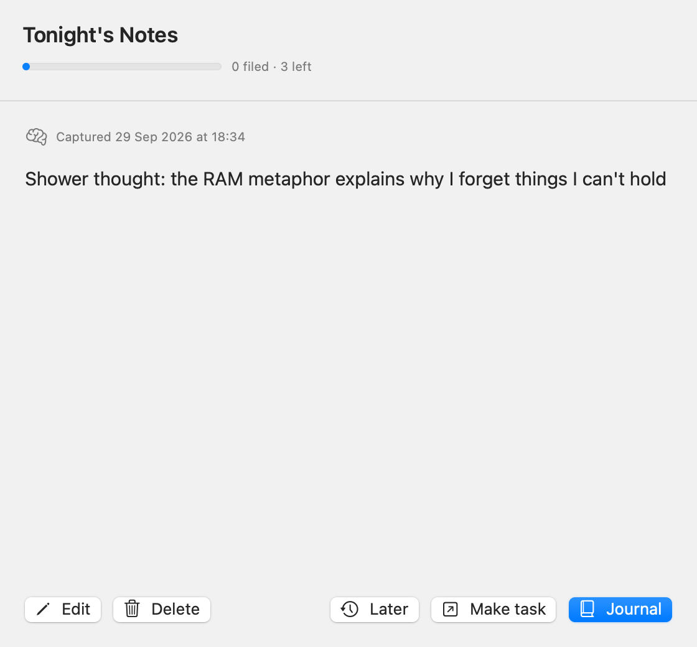

# Human RAM

[](https://github.com/DerekHam/Human-RAM/releases/latest)
[](https://github.com/DerekHam/Human-RAM/actions/workflows/ci.yml)
[](LICENSE)


A macOS menu-bar app that treats your attention like computer memory.

Most to-do apps ask you to organize. Human RAM asks almost nothing: you write a thought down in one keystroke, and the app decides when it should come back to you. It's built around a simple metaphor — your mind is **RAM**, and this app is a small external module for it.

Built by Derek Han with help from several AI agents.

> **Status: stable preview (0.2.x).** Human RAM is ready for everyday use — capture, the working set, decay, the daily scan, the nightly review, the diary and journal are all in. It stays a `0.x` while the schema and settings can still change between minor versions, so keep your own backups (Settings → **Your data** makes that one click). No account, no cloud, no telemetry.

## Install

**Homebrew (recommended — no security warning):**

```bash
brew tap DerekHam/human-ram
brew trust DerekHam/human-ram   # one-time: trust this third-party tap
brew install --cask human-ram
```

Homebrew requires an explicit `brew trust` the first time you install a cask
from a third-party tap (it shows the cask's contents and asks before anything
runs). It only needs to be done once.

**Direct download:** grab the latest **DMG** from
[Releases](https://github.com/DerekHam/Human-RAM/releases/latest), drag the app
to Applications, then double-click **Fix Gatekeeper.command** in the DMG (or
Control-click the app → **Open**). Human RAM is not notarized by Apple, so the
first launch needs that one-time step.

Then look for the **memory-chip icon in the menu bar** (no Dock icon), and
accept the notifications prompt. Press `⌘⇧N` anywhere to capture a thought.

- **Write** — a global hotkey opens a one-line capture box anywhere. Type, press Enter, done.
- **Volatile store** — captured items live in a small, bounded "working set" (like registers).
- **Pop out** — items with a due time fire native notifications when they matter.
- **Refresh** — a daily scan and a nightly note review bring the right things back.
- **Spill to disk** — anything that doesn't fit or goes stale moves to a quiet backlog, so nothing is lost.

It runs entirely offline. There is no account, no sync, no cloud. Data is a single SQLite file on your Mac.

---

## The RAM metaphor

| Computer memory | Human RAM behavior |
|---|---|
| Register / working set | A small set of "loaded" tasks (default capacity **7**), visible in the menu bar. |
| Volatile store | Items are held in RAM until they decay or are spilled. |
| Spill to disk | Overflow, stale, and not-yet-relevant items move to the **hard drive** backlog. |
| Long-term storage | Completed tasks go to the **Diary**; reviewed notes go to the **Journal**. |
| Interrupt / refresh cycle | The **daily scan** (tasks) and **nightly review** (notes). |

Two kinds of things live in the app:

- **Tasks** — executable memory. Lifecycle: `loaded → backlog → done`.
- **Notes** — volatile short-term memory (shower thoughts, class inspirations). Lifecycle: `inbox → journaled`.

Tasks and notes use separate capacities, separate intervals, and separate windows. Task logic never sees notes.

---

## Features

- Global-hotkey capture (`⌘⇧N`) that opens as a task; press **Tab** in the overlay to capture a note instead.
- A Task/Note toggle in the capture overlay; press **Tab** to switch. Staged **Enter** walks the RAM composer: content → start date → due date → complete.
- Priority by hotkey (**⌘1**–**⌘4**) in the overlay and the item editor.
- Numeric date entry: type `MMDDHHMM` (24 h), e.g. `09231920` → Sep 23, 19:20. Separators are optional. A calendar popover is available too. Tasks can carry both a **start** and a **due** date.
- **Auto-arrange:** tasks whose start (or due) is beyond a configurable window (default **48 h**) spill to the hard drive, and tasks entering the window load back into RAM. RAM stays what's relevant now.
- Bounded working set with automatic spill to a backlog ("hard drive").
- Decay: untouched loaded items dim, then spill automatically. Pinned items are exempt.
- Native notifications for due items, with a live menu-bar badge.
- **Daily Scan** window at a configurable time (default **19:20**).
- **Tonight's Notes** review at a configurable time (default **00:00**), card by card.
- **Diary** (completed tasks) and **Journal** (filed notes), both grouped by day and searchable.
- Convert a note into a task during review.
- Launch at login.
- Light and dark themes — follows macOS by default, or force either one from Settings.

---

## Screenshots

<picture>
  <source media="(prefers-color-scheme: dark)" srcset="docs/images/capture-dark.png">
  
</picture>

**Capture from anywhere** — press `⌘⇧N`; press `Tab` for a note.

<picture>
  <source media="(prefers-color-scheme: dark)" srcset="docs/images/menu-bar-dark.png">
  
</picture>

**The menu bar** — the working set, the hard-drive backlog, and notes at a glance.

<picture>
  <source media="(prefers-color-scheme: dark)" srcset="docs/images/daily-scan-dark.png">
  
</picture>

<picture>
  <source media="(prefers-color-scheme: dark)" srcset="docs/images/notes-review-dark.png">
  
</picture>

**Daily Scan** (tasks) and **Tonight's Notes** (notes review).

Regenerate these any time with `./Scripts/screenshots.sh` (renders the app's own
windows in light and dark — no Screen Recording permission needed).

## Requirements

- macOS 14.0 (Sonoma) or later.
- Xcode / Swift 5.9 toolchain (only for building). The app itself has **no third-party dependencies** — it uses system frameworks (`SwiftUI`, `AppKit`, `UserNotifications`, `Carbon`, `SQLite3`).

---

## Build from source

```bash
# Build the app bundle + widget extension (default: debug)
export HRAM_SIGN_ID="Apple Development: you@example.com (XXXXXXXXXX)"
./Scripts/build_app.sh

# Or an optimized build
./Scripts/build_app.sh release

# Launch it
open "build/Human RAM.app"
```

### Cut a release

```bash
# Universal (arm64 + x86_64) shareable app -> build/Human-RAM-vX.Y.Z-macOS.dmg + .zip
./Scripts/release.sh release

# Publish the Homebrew tap from Casks/human-ram.rb
./Scripts/setup_homebrew_tap.sh
```

Pushing a `v*` tag (or running the **Release** workflow manually) runs the tests
and attaches the DMG, zip, and checksums to a GitHub Release.

`build_app.sh` runs `swift build`, assembles `build/Human RAM.app` (`Contents/MacOS`, `Info.plist`, `AppIcon.icns`) plus the `HumanRAMWidget.appex` in `Contents/PlugIns`, then signs both with the Apple Development identity and the App Group entitlement.

The widget build needs a signing identity. Set it via `HRAM_SIGN_ID` (find yours with `security find-identity -v -p codesigning`). The bundle id and App Group are generic (`com.example.humanram`, `TEAMID` prefix) so no personal identifiers ship in the source — replace `TEAMID` in `Resources/*.entitlements` and `Sources/HumanRAMShared/WidgetSnapshot.swift` with your Apple Team ID (keep all three in sync), and adjust the bundle ids in `Resources/*.plist` if you like. If you don't have a signing identity, or want the original widget-free app, use the backup script — it assembles the same app and ad-hoc signs it, without the extension:

```bash
./Scripts/build_app_adhoc.sh
```

### Run the tests

```bash
swift test
```

### First-run tips

- macOS will ask permission for notifications. Accept it, or due reminders won't appear.
- The app has **no Dock icon** (`LSUIElement`). Look for the memory-chip icon in the menu bar.
- For launch-at-login and notifications to register cleanly, copy the app to `/Applications`:
  ```bash
  cp -R "build/Human RAM.app" /Applications/
  ```
- If the icon looks stale after a rebuild, refresh Finder/Dock: `killall Dock Finder`.
- **Quit a running instance before testing a rebuild.** macOS keeps the old executable mapped while the app runs, so a menu-bar instance that predates the build will keep showing the old behavior no matter how many times you rebuild. `killall HumanRAM` (or use the Quit button) and relaunch.

### Shareable build

To hand the app to someone else, build the app-only, self-contained variant:

```bash
./Scripts/build_share.sh release
open "build/Human RAM (Shareable).app"
```

It compiles with `-DHRAM_SHAREABLE`, which:

- gives it the bundle id `com.example.humanram.shared` — separate preferences and a separate notification permission,
- stores data in `~/Library/Application Support/HumanRAM Shared/`, never your own `HumanRAM` folder,
- disables the widget snapshot (the variant ships **no** widget extension), and
- shows a short **Welcome** guide on every launch until the reader unchecks "Show this guide at startup" (reopen it any time from **Settings → Guide**).

No sample data is seeded, so the recipient starts empty. The bundle is ad-hoc signed, so it can be copied and run without a signing identity (Gatekeeper will warn about an unidentified developer).

---

## Usage

### Capturing

| Action | Shortcut |
|---|---|
| Capture a task | `⌘⇧N` (opens as a task) |
| Capture a note | `⌘⇧N`, then `Tab` to switch |
| Switch Task/Note in the overlay | `Tab` |
| Store a task | `Enter` → content → start date → due date → complete |
| Store a note | `⌘⏎` |
| New line in a note | `Enter` |
| Add a longer note body | `⌥⏎` |
| Set priority (task) | `⌘1`–`⌘4` = None/Low/Normal/High |
| Cancel | `Esc` |

The RAM title stays single-line: `Enter` moves the cursor from the title to the start field, then to the due field, and `Enter` again stores the task. Notes are multi-line, so `Enter` inserts a newline and `⌘⏎` stores.

Priority can always be set from the keyboard without opening the priority menu: `⌘1`–`⌘4` work in the capture overlay, the item editor, and the menu-bar quick composer. The menu's per-item shortcut hints reflect the same mapping.

These task shortcuts are shared across every editing surface, including the item editor opened from the Daily Scan (or any task's **Edit…** action). The editor uses the same keys: `Enter` walks content → start → due, `⌘⏎` saves, `⌘1`–`⌘4` set priority, and `Esc` cancels without saving. The **Notes** area is multi-line like every other note field, so `Enter` inserts a newline there rather than advancing; click or Tab into the schedule fields. Plain `Enter` in the nightly review inserts a newline while editing, and `⌘⏎` saves the edit. Shortcut detection lives in `UI/Shortcuts.swift`; new keys belong there so every interface stays in sync.

Typing a date is optional. Use the calendar button for point-and-click. The **year** defaults to the current one each launch (a session default, adjustable via the year stepper): a date typed without a year is read as the next upcoming occurrence, but a date on **today** stays put rather than jumping a whole year. Impossible dates (e.g. `0230` for Feb 30) are reported as invalid rather than silently rolled over. Parsing lives in `Models/NumericDateParser.swift`, so it is unit-tested without a view.

### The menu bar

- The icon shows the task count (or due count), and a red dot when the notes inbox is full.
- The dropdown is wide and compact: every **loaded** task is always visible with no inner scroll, while the hard-drive backlog and pending notes share a short scroll area beneath it. Pending notes render as a one-line, two-column list.
- The quick composer at the top writes a **Task** or **Note** (segmented toggle) straight from the dropdown, with optional start/due dates and priority for tasks, and a button to pop out the full capture overlay.
- Press **Tab** in the composer to switch between Task and Note. (The menu-bar window is non-activating, so the app briefly activates while it is open; that is what lets the keyboard shortcuts reach it.)
- Hotkeys are shown inline: the configurable capture key sits next to the pop-out button, `⌘⏎` by the store button, and the `⌘1`–`⌘4` mapping in the priority menu, plus a compact hint line under the composer.
- Right-click a task row for actions: complete, edit, spill/load, pin, set priority, delete.
- Footer buttons open **Scan**, **Diary**, **Journal**, **Settings**, and Quit, each with a working shortcut.

| Menu-bar action | Shortcut |
|---|---|
| Capture (global, works anywhere) | `⌘⇧N` (configurable) |
| Store from the quick composer | `⌘⏎` |
| Set priority in the quick composer | `⌘1`–`⌘4` |
| Scan | `⌘D` |
| Diary | `⌘Y` |
| Journal | `⌘J` |
| Settings | `⌘,` |
| Quit | `⌘Q` |

### Widget

A **Human RAM** widget shows the tasks currently loaded in RAM, with due-date chips, in the macOS widget gallery and on the desktop / Notification Center. It comes in small, medium, and large.

- It reflects the working set only (kind `task`, state `loaded`), ordered like RAM (pinned, then priority, then due date).
- The app writes a small JSON snapshot (`ram-tasks.json`) to the App Group container and asks `WidgetCenter` to reload whenever items change.
- Add it from **Edit Widgets** on the desktop or in Notification Center. If it doesn't appear, launch the app once (or copy it to `/Applications`) so LaunchServices registers the extension, then restart the widget daemons: `killall chronod NotificationCenter`.

The shared snapshot lives at `~/Library/Group Containers/TEAMID.com.example.humanram/ram-tasks.json`. It is derived data — the real database is still `~/Library/Application Support/HumanRAM/humanram.sqlite3`.

### Daily Scan (tasks)

Opens at the configured time (and can be opened manually). Shows Overdue / Today / Upcoming / In RAM / Hard drive. "Load today's set" decays stale items and re-runs the auto-arrange, pulling window-eligible items from the backlog.

### Tonight's Notes (notes)

Opens at the configured time when notes are pending. Reviews the inbox one note at a time:

- **Journal** — file it with a timestamp (default action, `Enter`).
- **Make task** — convert it into a loaded task.
- **Edit**, **Later** (skip this session), **Delete**.

### Settings

| Setting | Default | Meaning |
|---|---|---|
| RAM capacity | 7 | Max loaded tasks before spill. |
| Auto-arrange | on | Spill/load tasks around the time window automatically. |
| Window | 48 hours | Tasks starting further out spill; tasks entering the window load. |
| Dim after | 3 days | When a loaded task starts fading. |
| Spill after | 10 days | When an untouched loaded task moves to backlog. |
| Digest at | 19:20 | Daily Scan time. |
| Notes: inbox capacity | 15 | Inbox size before the FULL flag. |
| Notes: nightly review | on | Enables the nightly review. |
| Notes: review at | 00:00 | Nightly review time. |
| Notes: open review on launch | off | If on, the review opens at launch when its time already passed; off leaves it to its scheduled time, the notification, or the menu-bar **Review** button. |
| Capture hotkey | `⌘⇧N` | Opens the capture box as a task; press `Tab` for a note. |
| Theme | System | Follow macOS, or force **Light** / **Dark** for Human RAM only. |
| Launch at login | off | Register via `SMAppService`. |
| Check for updates | on | One anonymous request to the public GitHub Releases list; shows a menu-bar banner when a newer stable version exists. |
| Guide at startup | on in shareable build | Show the welcome guide on launch; reopen from **Settings → Guide**. |

---

## Data & storage

- **Location:** `~/Library/Application Support/HumanRAM/humanram.sqlite3` (WAL mode). The shareable build writes to `~/Library/Application Support/HumanRAM Shared/` instead, so the two never share data.
- **Engine:** system `libsqlite3`, accessed through a thin wrapper (`Store/Database.swift`). No ORM.
- **Inspecting it:** `sqlite3 "~/Library/Application Support/HumanRAM/humanram.sqlite3"`.
- **Safety:** the database is copied to `Backups/` before every schema migration. **Settings → Your data** can back up on demand, reveal the files in Finder, and export/import the whole store as JSON. If the database is ever unreadable it is moved aside (`*.corrupt-<time>`) and the app starts fresh instead of crashing.

### Schema

```sql
CREATE TABLE items (
    id           TEXT PRIMARY KEY,   -- UUID
    kind         TEXT NOT NULL DEFAULT 'task',  -- 'task' | 'note'
    text         TEXT NOT NULL,
    detail       TEXT,
    due_at       REAL,               -- Unix epoch seconds, nullable
    start_at     REAL,               -- when the task enters RAM, nullable
    state        TEXT NOT NULL,      -- see below
    priority     INTEGER NOT NULL DEFAULT 2,    -- 0 none, 1 low, 2 normal, 3 high
    created_at   REAL NOT NULL,
    loaded_at    REAL,               -- when it entered the working set (decay)
    touched_at   REAL NOT NULL,      -- last meaningful touch (decay)
    completed_at REAL,               -- task completion or note journaling time
    pinned       INTEGER NOT NULL DEFAULT 0,
    updated_at   REAL,               -- last local mutation (used for sync LWW)
    deleted      INTEGER NOT NULL DEFAULT 0,  -- tombstone; deleted rows are kept
    dirty        INTEGER NOT NULL DEFAULT 0   -- 1 = needs pushing to the server
);
```

The last three columns are sync metadata. They are part of the base `CREATE TABLE` and are also added by an additive migration for databases created before they existed. `updated_at` is stamped on every mutation and split out from `touched_at` (which only drives decay). Deleting is a **soft delete**: the row stays with `deleted = 1` so the removal can propagate; every UI query filters `deleted = 0`. Existing rows are marked `dirty = 1` so the first sync pushes them. `ItemStore.dirtyItems` exposes the push queue.

### States

| kind | state | meaning |
|---|---|---|
| task | `loaded` | In the working set. |
| task | `backlog` | Spilled to the hard drive. |
| task | `done` | Completed; shown in the Diary. |
| note | `inbox` | Captured, waiting for review. |
| note | `journaled` | Filed; shown in the Journal. |

Because notes use their own states, every task query/mutation ignores notes automatically.

---

## Architecture

```
Sources/HumanRAMShared/       leaf module: widget snapshot types only
  WidgetSnapshot.swift        App Group id, Codable task snapshot, load/save
Sources/HumanRAMWidget/
  HumanRAMWidget.swift        WidgetKit extension: timeline provider + RAM view
Sources/HumanRAMCore/         portable: shared by macOS now, iOS later
  Models/
    Item.swift                Item, ItemKind, ItemState, ordering helpers
    AppSettings.swift         UserDefaults-backed preferences (ObservableObject)
    NumericDateParser.swift   MMDDHHMM parsing + next-occurrence year resolution
  Store/
    Database.swift            thin libsqlite3 wrapper + column helpers
    ItemStore.swift           in-memory copy of all items, write-through to SQLite
  Core/
    AppRouter.swift           navigation seam (macOS windows / iOS sheets)
    AppVariant.swift          compile-time variant: storage folder + guide default
    Scheduler.swift           due reminders, decay, daily scan, nightly review
    AppNotifications.swift    shared Notification.Name values
    UpdateChecker.swift       anonymous GitHub Releases update check
  UI/
    CaptureView.swift         capture overlay + CaptureModel + PriorityMenu
    DateTimeField.swift       MMDDHHMM numeric + calendar picker
    MultilineEditor.swift     TextEditor note area that always newlines on Return
    DigestView.swift          daily scan window
    NotesReviewView.swift     card-by-card nightly review
    DiaryView.swift           completed tasks
    JournalView.swift         filed notes
    EditItemView.swift        shared item editor
    ItemChips.swift           DueChip / StartChip
    Shortcuts.swift           keyboard handling (AppKit-gated)
  System/
    Notifications.swift       local notifications
Sources/HumanRAM/             macOS app shell
  HumanRAMApp.swift           @main, MenuBarExtra scene, badge label
  UI/
    MenuBarView.swift         dropdown, task rows, note rows
    SettingsView.swift        preferences + LaunchAtLogin
    GuideView.swift           welcome / how-to shown on launch in shareable build
  System/
    AppDelegate.swift         startup, router wiring, hotkey registration, debug hooks
    AppAppearanceController.swift  applies the System/Light/Dark theme choice
    SnapshotService.swift     HRAM_SNAPSHOT_DIR window-to-PNG screenshot pass
    HotKey.swift              Carbon global hotkeys (one instance per hotkey)
    CapturePanel.swift        floating NSPanel for capture
    WindowManager.swift       secondary windows with NSHostingView
Resources/
  Info.plist                  app bundle config (LSUIElement, icon, id)
  WidgetInfo.plist            widget extension config (widgetkit extension point)
  HumanRAM.entitlements       app: App Group
  HumanRAMWidget.entitlements widget: sandbox + App Group
  Assets/AppIcon.icns         generated icon
Scripts/build_app.sh          build + assemble app + widget + codesign
Scripts/build_app_adhoc.sh    backup build: app only, ad-hoc signed, no widget
Scripts/build_share.sh        shareable variant: -DHRAM_SHAREABLE, own data + bundle id
Scripts/release.sh            universal shareable app -> DMG + zip + checksums
Scripts/setup_homebrew_tap.sh create/update the Homebrew tap from Casks/human-ram.rb
Scripts/screenshots.sh        render docs/images/ light+dark via HRAM_SNAPSHOT_DIR
Casks/human-ram.rb            Homebrew cask (preferred install)
.github/workflows/            CI (test on push) + Release (publish DMG on tag)
Tests/HumanRAMTests/          unit tests for store rules, decay, ordering, date parsing
CHANGELOG.md                  release notes
```

### Key invariants

- `ItemStore` is the single source of truth. All mutations write through to SQLite immediately and publish via `@Published items`.
- All UI observes `ItemStore.shared` (and `AppSettings.shared`) via `@EnvironmentObject` / `@ObservedObject`.
- The capture overlay's state lives in `CaptureModel`, owned by `CapturePanel`, so a local `NSEvent` monitor can drive `Tab`/`Esc` reliably.
- Windows re-open through `WindowManager.shared.show…`, which reuses existing `NSWindowController`s; transient editors (the item editor) are rebuilt each time so their draft starts from the current item.

---

## Development

### Build configurations

`swift build -c debug|release`, or use `Scripts/build_app.sh debug|release`.

### Debug hooks (environment variables)

| Variable | Effect |
|---|---|
| `HRAM_DEBUG_SEED=1` | Seeds sample tasks and notes **if the store is empty**. |
| `HRAM_DEBUG_OPEN=1` | Opens every window (capture, scan, diary, review, journal, settings) so all views render. |
| `HRAM_DB_PATH=/path/db.sqlite3` | Uses an isolated database instead of the real one. |
| `HRAM_SNAPSHOT_DIR=/path` | Renders each window to an opaque PNG there and quits. Optional `HRAM_SNAPSHOT_APPEARANCE=light\|dark` and `HRAM_SNAPSHOT_SUFFIX=-dark` (`Scripts/screenshots.sh`). |

Example isolated smoke test:

```bash
HRAM_DB_PATH=/tmp/hram-test.sqlite3 HRAM_DEBUG_SEED=1 HRAM_DEBUG_OPEN=1 \
  "build/Human RAM.app/Contents/MacOS/HumanRAM"
```

### Adding a schema change

Migrations are additive and idempotent. Add columns in `ItemStore.migrate()` guarded by `columnExists(_:in:)`:

```swift
if !columnExists("my_column", in: "items") {
    db.exec("ALTER TABLE items ADD COLUMN my_column TEXT;")
}
```

Then update `reload()`, `insert()`, and `write()`, and add the column to the base `CREATE TABLE` too so fresh databases are created complete.

### Testing time-based rules

`ItemStore.applyDecay(now:)`, `applyTimeWindow(now:)`, `fillWorkingSet(now:)`, and `Item.freshness(decayDimDays:now:)` all accept an injected date, so tests can advance the clock instead of back-dating rows. Use that instead of sleeping or mutating timestamps directly.

---

## Notes for AI agents

If you are an AI assistant working in this repo, keep these in mind:

- **This is a personal, offline app.** The only network call is the anonymous GitHub Releases update check (`Core/UpdateChecker.swift`); do not add accounts, analytics, tracking, or third-party dependencies without an explicit request.
- **No comments in code** unless the user asks. Match the existing concise Swift style.
- **Keep tasks and notes separated.** Use distinct `ItemState` cases for anything note-related; never route notes through task queries (`loaded`, `backlog`, `completed`, `enforceCapacity`, `applyDecay`, `badgeCount`).
- **Respect the invariants** above: `ItemStore` owns state; UI never writes SQL directly.
- **Keep shortcuts in sync.** Keyboard handling is centralized in `UI/Shortcuts.swift`. `⌘⏎`/`⌥⏎`/`esc` go through `.shortcutActions(store:cancel:detail:)`; `⌘1`–`⌘4` priority is captured by one app-level monitor in `AppDelegate` that posts `.humanRAMSetPriority` addressed to the key window, and each editing surface applies it with `.priorityShortcut`. Keep priority out of the per-view monitors so the key is always consumed (an unhandled `⌘1`–`⌘4` makes the system beep). The capture overlay, item editor, menu-bar quick composer, and notes review must all recognize the same keys (`⏎` next on single-line fields, `⌘⏎` store/save, `⌘1–4` priority, `⇥` task/note, `esc` cancel). Detect keys via `Shortcuts`, never with ad-hoc `keyCode` checks, and apply the modifier to every new editing surface so the experience stays uniform.
- **Note bodies use `MultilineEditor` (a `TextEditor` wrapper), not `TextField(axis: .vertical)`.** A vertical `TextField` can still be pulled into a submit/default action by another Return shortcut in the window, which ends editing and selects the whole value instead of inserting a newline. `TextEditor` owns Return, so note bodies always get a real newline; add a note field through `MultilineEditor` to keep that guarantee.
- **Keep date entry pure.** `Models/NumericDateParser.swift` owns `MMDDHHMM` parsing and next-occurrence year resolution. Keep it free of side effects and unit-tested; views must not mutate state (or `AppSettings`) while rendering. Impossible dates are rejected by round-tripping the built date through the calendar.
- **The widget reads derived data, never the database.** `ItemStore` writes a JSON snapshot of loaded tasks to the App Group container (`Sources/HumanRAMShared/WidgetSnapshot.swift`) and calls `WidgetCenter.reloadAllTimelines()`. The snapshot is a cache: keep the real SQLite DB out of the group container, and keep the `sharesWithWidget` guard so `HRAM_DB_PATH` runs (tests, smoke tests) never write into the real App Group. Changing the App Group id means updating both entitlements files, `WidgetShared.appGroup`, and the README.
- **The widget `.appex` Info.plist must keep `CFBundleSupportedPlatforms = [MacOSX]`.** Without it macOS never treats the bundle as a widget extension and it silently never appears in the widget gallery (chronod logs `Plugins did uninstall`). When iterating on the widget, rebuild, replace the app in `/Applications`, then `killall chronod NotificationCenter` to force rediscovery. The App Group prefix must equal the signing **TeamIdentifier** (`codesign -dvv` on the app), not the certificate CN's parenthetical.
- **Verify changes** with `swift test` and the `HRAM_DEBUG_OPEN` smoke test. Never test against the user's real database — use `HRAM_DB_PATH`.
- **Never clear or reset the real database** at `~/Library/Application Support/HumanRAM/`. It contains the user's actual data.
- **The user's real task/notes data is not disposable.** When testing, always isolate.
- Builds produce `build/Human RAM.app` (note the space in the name; quote paths).

---

## Roadmap / known limitations

- The **hotkey recorder** is not implemented; Settings only offers reset-to-default. `⌘⇧N` is the default.
- The notes inbox soft-caps: it flags **FULL** past capacity and never auto-files, rather than refusing captures.
- **Not notarized.** Releases are ad-hoc signed, not signed with a paid Apple Developer certificate, so macOS warns on first launch. The Homebrew cask and the DMG's **Fix Gatekeeper.command** both clear the quarantine flag; there is no way to remove the warning without a $99/yr Developer ID.
- **No widget in the released build.** The shareable app ships without the widget extension, because App Groups require a real Team ID. The widget is available in the locally built full app (`build_app.sh`).
- `build_app.sh` produces a Developer ID / Apple Development–signed bundle (needs `HRAM_SIGN_ID`); `build_app_adhoc.sh`, `build_share.sh`, and `release.sh` produce ad-hoc signed bundles.
- The daily scan opens at its trigger time (or on launch, if its time already passed and it hasn't run that day). The nightly review opens at the trigger time while the app is running, from the notification, or from the menu-bar **Review** button; it only opens at launch when **Open review on launch** is enabled.

---

## License

MIT © Derek Han. See [LICENSE](LICENSE).
